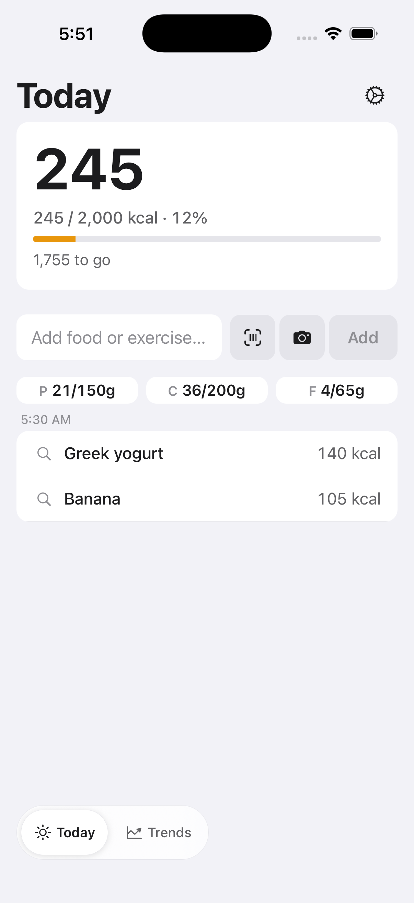
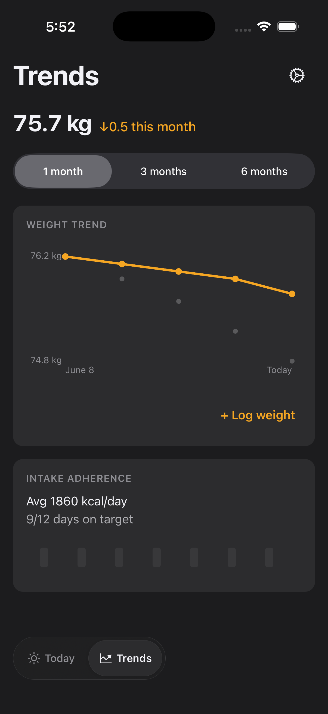
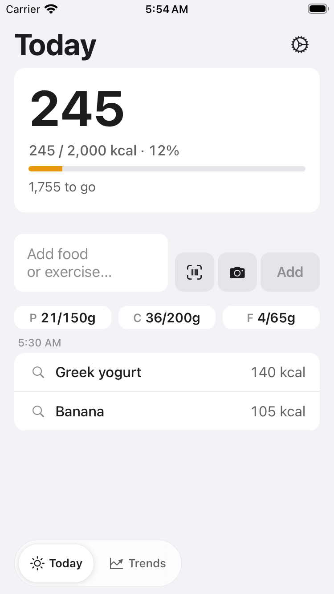
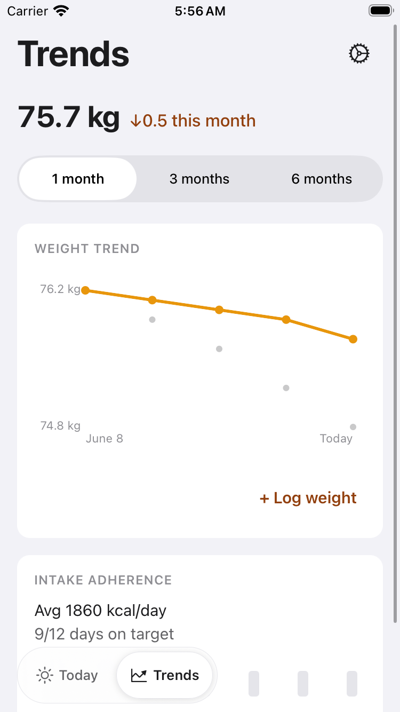
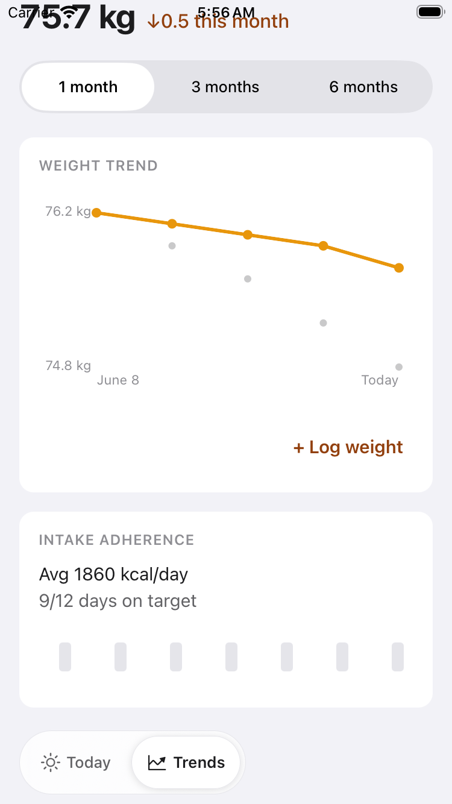
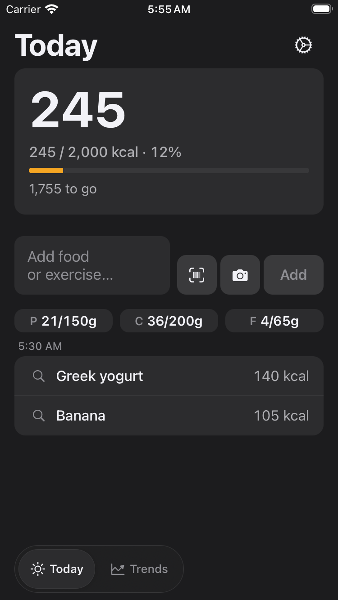

# FTY-259 — Floating glass switcher visual audit: Today + Trends

Running-app screenshots proving the floating glass switcher (FTY-242) reads as
intended over **real, non-empty** Today and Trends content, and that Today/Trends
bottom content is reachable — not trapped under the pill or home indicator — on
an SE-class and a large iPhone. This is a visual-audit story: no product code
was changed; any defect found is filed below as a planner note rather than
fixed inline.

## How these were captured

- Built this worktree's own dev-client (`expo prebuild` + `pod install` +
  `xcodebuild`, per the established local toolchain recipe: CocoaPods via
  `CP_HOME_DIR=/tmp/fatty-e2e-tools/cocoapods`, `xcodebuild` with
  `-derivedDataPath /tmp/fatty-e2e-tools/DerivedData-fty259` since this Mac's
  sandbox blocks the default DerivedData path). One throwaway, uncommitted
  workaround was needed: this Mac's `ibtool`/`IBAgent-iOS` cannot spawn a
  preview simulator (sandboxed CoreSimulator write), which otherwise hard-fails
  `CompileStoryboard` for `SplashScreen.storyboard` and blocks the whole build;
  the generated (gitignored-equivalent, untracked, deleted after capture)
  `mobile/ios/Fatty.xcodeproj` had that one file dropped from its Resources
  build phase so the rest of the target links normally — the launch screen
  storyboard is cosmetic only and this has no bearing on the switcher/timeline
  behaviour under audit.
- **Large iPhone**: leased `Fatty-Slot-0` from the shared sim-slot pool
  (`scripts/sim-slot.sh`, label `FTY-259`) — an iPhone 17 Pro — and released it
  back to the pool once its captures were done.
- **SE-class**: the shared pool only provisions iPhone 17 Pro-class devices, so
  a dedicated `iPhone SE (3rd generation)` simulator was created for this run,
  driven directly (never `booted`), and deleted afterward so it leaves no
  residual state for other concurrent runs.
- Both devices ran the same Metro instance (port 8090, `EXPO_PUBLIC_FATTY_E2E=true`)
  serving this branch's JS — installed the same built `.app`, repointed via
  `RCT_jsLocation`.
- **Real, non-empty Today content**: the E2E fixture mock (`mobile/e2e/`) is a
  scripted phase machine keyed on specific raw-text submissions, not a general
  seed — it does not support accumulating many independent rows across
  multiple submissions in one session. The entry-resolve flow's phrase ("greek
  yogurt and banana") was used to log **two real, derived-item rows** ("Greek
  yogurt, 140 kcal" / "Banana, 105 kcal") into Today's own timeline via the
  actual composer → submit → pull-to-refresh path (not a fabricated overlay) —
  the same real data-path FTY-181's `resolve.yaml` exercises. This is a
  genuinely richer Today than FTY-242's empty-state captures, though still
  short of a long scrollable feed; see Notes.
- **Real Trends content**: unchanged from FTY-242 — the weight-trend card and
  intake-adherence card render from the E2E weight/daily-summary range fixtures.
- Each device/screen captured in both **light** and **dark** appearance
  (`xcrun simctl ui … appearance`, no relaunch needed) and at **top-of-scroll**
  and **scrolled-near-bottom**.
- A pre-existing, unrelated dev-mode redbox appears on cold launch (see Notes)
  and was dismissed (2 taps) before every capture sequence; it does not block
  navigation or the flows below.

## Evidence ↔ acceptance criteria

| Criterion | Evidence |
| --- | --- |
| `docs/verification/FTY-259/` contains Today + Trends screenshots, light + dark, SE-class + large iPhone, including scrolled-near-bottom frames, each showing the switcher over real content | all 16 files below |
| Switcher legible over real content, light and dark, clear active segment, no unreadable overlap | every screenshot — the pill's translucent material stays legible over the Today timeline rows and Trends cards in both appearances; the active segment (Today/Trends) is visibly raised/highlighted in every frame |
| Today/Trends bottom content reachable, not occluded, on SE-class and large iPhone | large iPhone: `iphone17pro-*-{today,trends}-top.png` and the matching `-bottom.png` are pixel-identical (content already fits above the pill — same pattern FTY-242 documented); SE-class Today: `iphonese-*-today-top.png` / `-bottom.png` are likewise identical (2 real rows still fit above the pill on SE); SE-class Trends: `iphonese-*-trends-top.png` shows the intake-adherence card's day-bar row partly under the pill at rest, and `iphonese-*-trends-bottom.png` shows the same row fully cleared after scrolling — the reserved-clearance contract (FTY-258) working exactly as designed |

## Files

Large iPhone (iPhone 17 Pro): `iphone17pro-{light,dark}-{today,trends}-{top,bottom}.png`
SE-class (iPhone SE 3rd gen): `iphonese-{light,dark}-{today,trends}-{top,bottom}.png`

### iPhone 17 Pro — light

### iPhone 17 Pro — dark

### iPhone SE (3rd gen) — light

### iPhone SE (3rd gen) — dark

## Assessment

- **Legibility**: pass, all four device/mode combinations. The pill's material
  stays readable over both the light Today/Trends background and the dark
  variant; the active segment is unambiguous in every frame.
- **Occlusion**: pass. On the large iPhone neither screen's content ever
  reaches the pill (top and bottom captures are identical). On SE-class, Today's
  two real rows also fit clear of the pill; Trends' last card sits partly under
  the pill at rest but scrolls fully clear, proving the reserved clearance
  (FTY-257/FTY-258) actually works at runtime, not just in the layout-padding
  unit tests.
- No incoherent overlap or one-note decorative glass was observed in any frame.

## Notes / limitations

- **Today's real content ceiling**: the hermetic E2E mock is a single-flow phase
  machine (each distinct raw-text submission sets its own stage flag, but the
  by-date/list reads only ever serve ONE flow's result at a time, keyed by a
  fixed priority order) — it cannot be made to accumulate many independent rows
  without changing `mobile/e2e/` fixtures, which is out of this audit's scope
  (no product/test-fixture code changes). Two real rows is the practical
  ceiling reachable through the existing hermetic flows, and on both device
  sizes that content still fits above the switcher without forcing a scroll.
  The scrolled-near-bottom Today frames are therefore pixel-identical to the
  top-of-scroll frames on both devices — a real, if modest, verification of "no
  occlusion" rather than a demonstration of scroll-driven reveal. Trends
  (unchanged, richer fixture content) is what exercises the genuine
  scroll/occlusion-clearing behaviour on SE-class.
- **Pre-existing dev-mode redbox** (filed as a planner note, not fixed here):
  a stray Jest test file lives directly at `mobile/app/day.test.tsx` — inside
  Expo Router's file-based route root — instead of a non-route location.
  Router eagerly validates every file under `app/` at startup, so it evaluates
  this test file too; its top-level `jest.mock(...)` call throws
  (`Property 'jest' doesn't exist`) since no test runner is present in a real
  app process, producing a LogBox redbox on every cold launch (dismissible in
  2 taps; the app is fully functional underneath — confirmed by every flow in
  this audit completing normally after dismissal). Unrelated to the floating
  switcher; likely present since whichever story added `app/day.test.tsx`
  rather than colocating it under a non-route test directory.
